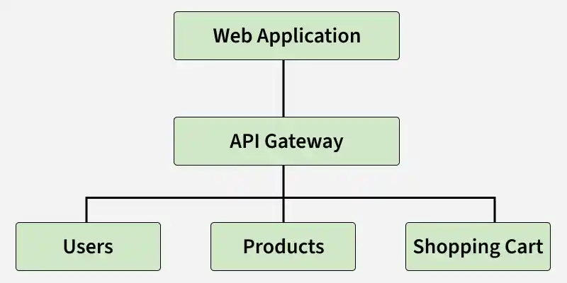

What are Microservices?
Microservices are an architectural style where an application is developed as a collection of small, independent, loosely coupled services that communicate via APIs.

What are the key benefits of Microservices?
Scalability (independent scaling of services)
Faster deployments
Technology diversity (polyglot approach)
Resilience (failure in one service doesn’t crash entire system)
Easier maintenance

What are the main challenges in Microservices?
Complex inter-service communication
Data consistency management
Service discovery
Monitoring and logging across multiple services
Security

Difference between Monolithic and Microservices Architecture?
Monolithic → Single codebase, tightly coupled, hard to scale.
Microservices → Independent services, loosely coupled, easier scaling.

What are API Gateways in Microservices?
An API Gateway acts as a single entry point for clients to access multiple microservices.
👉 Example: Netflix Zuul, Spring Cloud Gateway, Kong.

How do microservices communicate with each other?
Synchronous: REST API, gRPC
Asynchronous: Message Brokers (RabbitMQ, Kafka, ActiveMQ)

How do you secure Microservices?
OAuth2 / JWT authentication
API Gateway authentication
Role-based access control (RBAC)

What is the difference between REST and gRPC?
REST → Human-readable JSON, good for external APIs.
gRPC → Binary protocol (Protobuf), faster, better for internal microservices.

What is gRPC?
GRPC Remote Procedure Calls, or gRPC for short, is an open-source RPC framework enabling simple and effective communication between services. Providing many speed advantages, gRPC employs Protocol Buffers for serialization and HTTP/2 as its transport protocol instead of RESTful APIs using JSON over HTTP/1.1.

What is the primary role of an API Gateway?
Act as a centralized entry point for client requests

Which function of API Gateway combines multiple backend responses into one?
Request Aggregation

API Gateway with Microservices Example
A real-world pattern where the API Gateway acts as a single entry point to efficiently manage and coordinate multiple microservices behind the scenes.

Explanation of the diagram
Client sends request (e.g., view product or place order) to the API Gateway
API Gateway authenticates the user and routes the request to the relevant microservice(s)
It may aggregate responses (e.g., product + reviews + price) before sending back
Final response is returned to the client through the API Gateway

API Gateway works:

. Routing: Directs client requests to the appropriate service based on URL, method, or headers.
. Protocol Translation: Converts requests between protocols (e.g., HTTP to gRPC/WebSocket).
. Request Aggregation: Combines multiple backend service calls into a single response, reducing client-side requests. However,
  it may increase latency as the gateway waits for responses from multiple services before returning the final result.
. Authentication & Authorization: Validates user identity and access permissions.
. Rate Limiting & Throttling: Controls request traffic to prevent abuse and ensure system stability.
. Load Balancing: Distributes requests across multiple service instances for better scalability.
. Caching: Stores frequently accessed responses to improve performance.
. Monitoring & Logging: Captures metrics and logs for observability and debugging.

What does rate limiting in an API Gateway do?
Controls the number of requests

Which feature helps API Gateway improve performance by storing frequently accessed data?
Caching

What is a key challenge of using an API Gateway?
Can become a single point of failure

Which API Gateway solution is an open-source platform built on Nginx?
Kong